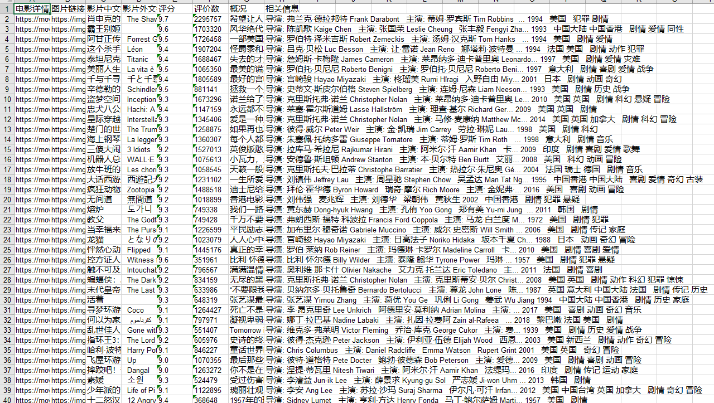

# Web-Data-Crawler-Tool
It is Data Crawler Tool to obtain data related to audiences’ film preferences and conducted statistical analysis.
We choose Douban Movie Network as a demonstration, and collect the relevant information of Douban Movie TPO250 in the table

